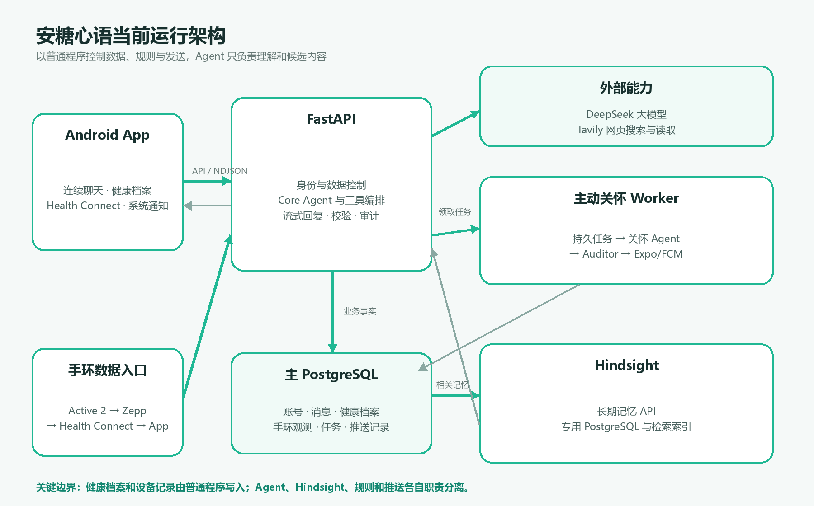

# 安糖心语系统设计说明

版本：V1.0（阶段整理稿）  
日期：2026 年 8 月 10 日  
整理人：张旭睿

## 1. 文档目的

本文只说明当前系统“怎样运行、各部分负责什么、数据怎样流动”。产品范围和验收标准见《产品需求说明》，完成情况见《项目阶段进展与功能对照》。本文描述的是当前仓库和实际运行环境，不照搬原 V3-E 文档中尚未落地的 Kotlin 业务内核、RabbitMQ、对象存储、七组件数字孪生或七类固定 Agent。

## 2. 设计概览

安糖心语不是让多个 Agent 自由互相对话，而是一个普通的客户端/服务端系统：Android App 负责交互和本地健康数据读取，FastAPI 负责身份、数据、规则和 Agent 编排，PostgreSQL 保存业务事实，独立 Worker 处理到期的主动关怀任务。

大模型只负责理解用户表达、选择能力和生成候选内容。身份校验、数据写入、数值换算、并发冲突、任务调度、免打扰、消息去重和推送发送均由普通程序控制。

## 3. 当前运行组件

### 3.1 Android App

Android App 使用 React Native、TypeScript 和 Expo。它负责注册登录、连续聊天、流式回复展示、侧边栏、健康档案、Health Connect 读取、拍照/文件选择、主动关怀设置和系统通知。

App 不直接连接数据库，也不直接调用大模型。它通过 HTTPS/局域网 HTTP 调用 FastAPI；用户点击通知后，App 使用通知中的消息标识读取并定位同一聊天记录。

### 3.2 FastAPI 后端

FastAPI 是移动端唯一业务入口，也是系统的可信控制层。它负责：

- 校验账号和登录会话，隔离不同用户的数据。
- 保存聊天消息、健康档案、手环观测、设置和任务。
- 为 Core Agent 组装本轮需要的上下文。
- 执行联网、手环查询、健康档案和计划工具。
- 校验 Agent 提出的结构化候选，再决定是否写入。
- 以 NDJSON 流式返回聊天正文和安全活动状态。
- 保存 Agent 运行、工具调用、来源和失败状态，便于复核。

### 3.3 主 PostgreSQL

主 PostgreSQL 是业务事实来源，保存用户与登录会话、全部原始聊天、摘要快照、Agent 运行、工具记录、健康档案、手环观测、关怀设置、计划任务和推送记录。LangGraph 的运行检查点也保存在 PostgreSQL 中。

原始聊天永久保留用于审计和重新处理。较早对话会生成不可变摘要，模型输入只装入与本轮相关的摘要、原文和工具结果，避免上下文无限增长。

### 3.4 Hindsight 与专用 PostgreSQL

Hindsight 是独立的长期记忆服务，不是 Agent，也不是主数据库。系统每累计三次成功的 Core 对话，把这段完整消息按原顺序写入当前用户的记忆库；聊天和主动关怀再按当前主题召回少量相关记忆。

发生冲突时，用户当前表达优先，其次是主 PostgreSQL 中的健康档案，Hindsight 只作可能过时的参考。Hindsight 使用自己的 PostgreSQL 保存事实、Observation 和检索索引，不与业务表混用。

### 3.5 主动关怀 Worker

主动关怀 Worker 使用与 API 相同的后端镜像，但作为独立进程运行。它每隔数秒检查 PostgreSQL 中是否有到期任务，使用租约和数据库锁避免两个 Worker 重复处理同一任务。

普通程序先检查用户设置、免打扰、频率限制、计划是否有效和用户是否刚刚发言，再调用主动关怀 Agent。只有 Agent 决定发送且 Auditor 审核通过，程序才会把消息和推送任务写入数据库。

### 3.6 外部服务

- DeepSeek：提供 Core、健康档案、主动关怀和 Auditor 使用的大模型能力。
- Tavily：提供网页搜索和网页正文读取。
- Expo Push Service：接收服务器的 Android 推送请求。
- Firebase Cloud Messaging：把 Expo 接受的通知投递到 Android 系统。
- Health Connect：位于手机端，向 App 暴露 Zepp 已写入的健康记录。

## 4. Agent 角色与边界

当前真正运行的模型角色有四个。

### 4.1 Core Agent

Core Agent 是唯一直接回复用户的 Agent。每轮开始前，服务器为它准备稳定规则、当前健康档案、相关长期记忆、有效计划、较早对话摘要和近期原始消息。分钟级手环数据不会默认全部塞入上下文；用户明确询问设备数据时才调用只读工具。

Core 当前可以使用网页搜索、网页读取、手环历史查询、健康档案委派和计划管理。工具是否能并行、能否写数据以及最后一轮是否还能搜索，都由后端中间件限制。

### 4.2 健康档案管理 Agent

健康档案管理 Agent 由 Core 通过一个委派工具调用。服务器为它另建独立运行，提供当前档案、待处理卡片、最近五轮对话和当前消息。

该 Agent 只返回结构化修改建议，不能直接写数据库。普通程序继续完成单位换算、取值范围、版本冲突、确认卡选项和最终写入。因此它与 Core 不共享一块可随意修改的 State，也不会用模型输出直接覆盖档案。

### 4.3 主动关怀 Agent

主动关怀 Agent 不在用户的聊天请求中运行，而是由 Worker 的到期任务直接启动。它获得任务原因、健康档案、近期聊天、对话摘要、上次关怀和相关长期记忆，然后选择发送或跳过。

### 4.4 主动关怀 Auditor

Auditor 只审核主动关怀草稿是否越过医疗边界、虚构数据或包含不合适内容。它只能通过或拒绝，不能自行改写、写数据库或发送通知。

Hindsight、心率规则、Health Connect、Expo 和 FCM 都不是 Agent。当前没有按照原 V3-E 文档固定拆成七个专业 Agent；只有具备独立上下文、工具权限或评价标准的任务才考虑拆分。

## 5. 核心运行流程

### 5.1 用户聊天

1. App 生成本次消息的唯一编号并提交文字。
2. 后端保存用户消息，建立 Core Agent 运行。
3. 上下文模块读取健康档案、相关记忆、摘要、近期原文和有效工具结果。
4. Core 直接回答，或调用联网、手环、健康档案、计划工具。
5. 工具参数由 Schema 校验，工具结果写入审计记录后再返回模型。
6. 后端把可见文字流式发送给 App，并最终保存一条助手消息。
7. 网络断开、取消或失败时保留已产生文字和明确终态，用户可以重试最后一次失败回复。

### 5.2 健康档案更新

1. Core 判断当前消息可能包含个人健康信息后，委派健康档案 Agent。
2. Agent 返回“直接应用、需要确认、需要补充或不修改”的候选。
3. 普通程序校验类型、单位、范围、来源和当前档案版本。
4. 明确且完整的用户陈述可以直接写入；有歧义时生成固定选项卡片。
5. 用户在卡片或健康档案页面确认、纠正、编辑或撤回。
6. 后端以操作编号防止网络重试造成重复修改，并保存来源和审计记录。

### 5.3 手环数据同步

真实数据链路是：

`Amazfit Active 2 → Zepp App → Health Connect → Android App → FastAPI → PostgreSQL`

App 读取 Health Connect 的增量记录，统一类型、时间、单位和来源后分页上传。服务器按来源记录和内容指纹去重，并只向当前用户开放查询。Core 和健康档案 Agent只能通过只读工具获取带观测时间的服务器历史记录。

当前支持十类 Zepp 数据，包括步数、锻炼、距离、爬升高度、体重、呼吸频率、静息心率、分钟级心率、睡眠阶段和血氧。系统没有直接连接手环，因此不能承诺实时性。

### 5.4 长期记忆

1. Core 对话成功完成后推进每位用户独立的同步游标。
2. 累计三次成功对话后，将尚未同步的完整短对话写入 Hindsight。
3. 下一轮根据当前问题召回相关记忆，而不是把全部历史塞进模型。
4. Core 和主动关怀分别获得符合自己职责的少量记忆。
5. Retain 或 Recall 失败时当前运行明确失败，不在用户不知情的情况下忽略记忆。

### 5.5 主动关怀与推送

1. 日常问候设置、明确同意的计划复盘或健康导入事件在 PostgreSQL 中形成任务。
2. Worker 领取到期任务，并执行授权、免打扰、冷却、频率、有效期和用户插话检查。
3. 健康事件当前只进入影子评测；日常问候和计划回访可以调用主动关怀 Agent。
4. Agent 选择跳过或生成草稿；草稿必须交给 Auditor。
5. 审核通过后，普通程序再次检查用户状态，并在一个提交过程中写入聊天消息和推送记录。
6. 推送 Worker 把消息交给 Expo，再经 FCM 投递到 Android。
7. App 前台只刷新聊天，不重复显示系统横幅；后台和锁屏显示通知。

## 6. 数据优先级与冲突处理

同一信息冲突时使用以下顺序：

1. 用户在当前消息中明确说出的内容。
2. 用户确认或亲自维护的健康档案。
3. Hindsight 中召回的长期记忆。
4. 模型根据上下文作出的推测。

设备记录是不可修改的原始观察；健康档案是经过管理的权威结论；长期记忆用于陪伴连续性。三者用途不同，不放在一张“万能用户状态”里互相覆盖。

## 7. 部署结构

Docker Compose 当前运行五个主要服务：主 PostgreSQL、Hindsight PostgreSQL、Hindsight API、FastAPI 和主动关怀 Worker。API 与 Worker 复用同一后端镜像，但启动命令和职责不同；Worker 不是每几秒重启，而是在单一进程内持续循环扫描任务。

Android App 通过 Expo development build 或 preview APK 安装。Firebase 项目标识随 App 构建，FCM 服务账号只保存在 EAS，不进入仓库和 APK。

## 8. 安全与可靠性设计

- 每个 API 查询都从当前登录身份得到用户范围，客户端不能自行指定其他用户。
- 手机写请求使用操作编号或版本号，网络重试不重复写入，并发修改返回明确冲突。
- 每位用户同一时间只运行一个 Core 根任务；主动关怀使用持久任务、租约和唯一约束去重。
- 主动关怀发送前检查免打扰、设置、用户插话和安装绑定，Auditor 通过后才落库。
- 日志只记录运行元数据，不记录聊天正文、健康值、密码和凭据。
- Agent 无数据库或推送凭据，关键数据写入由普通程序完成。
- 上下文过长时先清理旧工具结果，再生成可审计摘要；仍超限就明确失败。

## 9. 当前边界

已经运行的系统不能等同于完整医疗产品。当前尚未接入 CGM/真实血糖，心率异常只做影子评测；图片和报告只能在手机选择、尚不能上传解析；语音转写、FoH 专业量表和 Core 医疗回答审核尚未实现。

推送基础通道已经在 Android 真机验证，但真实主动关怀仍需完成一次“Agent 起草 → Auditor 通过 → 聊天落库 → 系统通知 → 点击定位”的完整验收。Android 十五分钟后台 Health Connect 任务也需要继续验证 Doze 和厂商省电环境下的实际调度。
