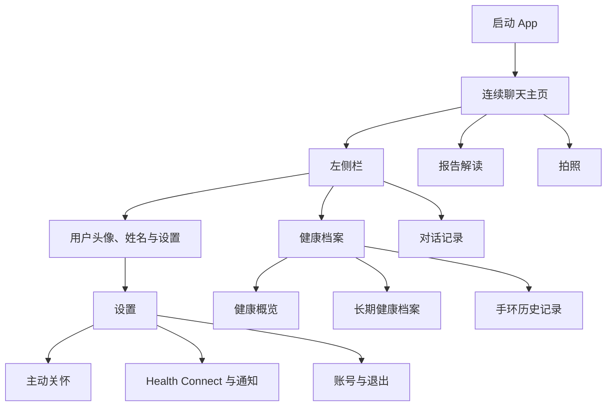
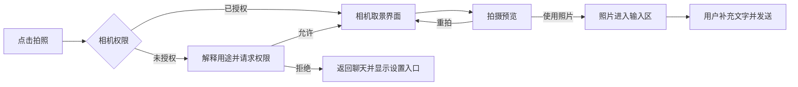
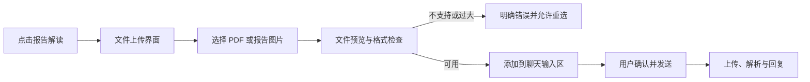

# 安糖心语移动端页面设计

版本：V1.1  
状态：已确认并完成首轮实现，后续移动端改版以本文件为准

## 1. 文档职责

本文只描述 Android App 的页面结构、视觉规范、交互行为和页面状态，不描述 Agent 编排、数据库表、接口字段或部署方式。产品需求、系统设计和实现状态分别维护，不在本文件中混写。

本文所写的“目标行为”不等于当前已经实现。拍照、文件上传、报告解析和历史位置跳转等功能需要在对应开发批次完成后，才能标记为已实现。

## 2. 设计目标

安糖心语首先是一位长期陪伴用户的健康助手，App 打开后直接进入同一个连续聊天窗口。界面需要同时满足以下目标：

- 清爽、可信、易读，不使用米黄色生活方式风格。
- 让聊天成为绝对主界面，不增加底部导航栏。
- 健康档案和历史对话从侧边栏进入，重要能力可被发现但不挤占聊天空间。
- 删除无信息价值的口号、重复说明和过小文字。
- 真实数据、演示数据和医疗安全提示在视觉上明确区分。
- 页面首先服务真实使用，其次才服务项目展示和论文截图。

## 3. 设计参考与取舍

视觉方向参考蚂蚁阿福和小荷 AI 医生在官方应用商店展示的界面：

- [蚂蚁阿福 App Store 页面](https://apps.apple.com/cn/app/id6743828427)：浅冷色背景、白色内容面、明确的蓝紫强调色和克制的卡片层级。
- [小荷 AI 医生 App Store 页面](https://apps.apple.com/cn/app/id6746402600)：浅薄荷绿、白色面板、深色大字和绿色操作按钮。

本项目吸收两者共同的“冷色底、白色内容面、单一品牌色、清晰大字”原则，不复制其吉祥物、品牌图标、页面文案或具体布局。

## 4. 已确认的信息架构



已确认的产品决定：

- 不使用底部导航栏。
- 不提供“新建对话”或“清空当前对话”。
- 不增加当前业务不存在的“医疗保障”入口。
- 取消“今日”作为独立顶级页面，其中有价值的健康内容合并到健康档案概览。
- 主动关怀、设备同步、通知和退出登录进入设置，不继续挤在侧边栏主页。

## 5. 全局视觉规范

### 5.1 色彩

| 用途 | 色值 | 使用范围 |
|---|---:|---|
| App 背景 | `#F5F9F8` | 聊天背景、列表背景 |
| 内容面 | `#FFFFFF` | 消息、卡片、输入框、侧边栏 |
| 品牌主色 | `#20B894` | 主按钮、当前状态、用户消息 |
| 品牌深色 | `#11866F` | 按下状态、重要链接 |
| 品牌浅色 | `#E7F7F2` | 选中项、轻提示、快捷入口 |
| 主文字 | `#17302E` | 标题和正文 |
| 次文字 | `#667875` | 时间、来源和辅助说明 |
| 分割线 | `#E4ECEA` | 列表分隔、输入框边界 |
| 风险色 | `#DE665B` | 错误、风险和必须处理的异常 |
| 风险浅色 | `#FCEDEA` | 风险提示背景 |

页面不再使用米黄、纸张色和大面积珊瑚色。风险色不能作为装饰色使用，避免健康异常与普通强调混淆。

### 5.2 字体与字号

统一使用系统无衬线字体，不再使用衬线标题。

| 层级 | 建议字号 |
|---|---:|
| 页面主标题 | 24–28 |
| 导航标题 | 18 |
| 消息正文 | 16 |
| 列表标题、按钮 | 15–16 |
| 次要信息 | 13–14 |
| 数据来源和安全说明 | 12–13 |

正文行高约为字号的 1.45 倍。产品界面不使用小于 12 的可见文字，不用全大写英文和额外字间距制造“设计感”。

### 5.3 间距、圆角与阴影

- 页面左右边距为 16，主要区块间距为 20–24。
- 普通卡片圆角为 14–18，输入框和胶囊按钮可以使用更大圆角。
- 同一页面避免“卡片套卡片”。能用留白和分割线表达分组时，不再增加背景框。
- 阴影只用于侧边栏、浮层和需要体现上下关系的内容，普通卡片不使用明显阴影。
- 所有可点击目标至少为 44×44。

### 5.4 图标

- 全 App 采用 `Hugeicons Stroke Rounded` 免费图标集，不与 Lucide、Tabler 或其他线性图标库混用。产品 Logo 和用户头像不受此限制。
- 常规图标使用 20 或 24 的视觉尺寸，线宽统一为约 1.8；强调操作通过品牌色背景表达，不随意改变图标线宽。
- 常用图标包括：侧边栏、设置、健康档案、文件、相机、附件、发送、停止、返回和更多。
- 图标按实际含义选择：健康档案使用档案或健康记录语义，不能使用容易被理解为急救或新增医疗服务的图形；报告解读使用带数据特征的文件图标。
- 图标不能再用单个汉字放进方块代替，例如不再使用“健”“关”“聊”作为功能图标。
- 图标负责识别，文字负责消除歧义；除发送、返回等高度通用操作外，不使用只有图标而没有无障碍名称的按钮。

## 6. 主对话页面

### 6.1 页面布局

```text
┌──────────────────────────────────┐
│  ☰             安糖心语          ··· │
├──────────────────────────────────┤
│                                  │
│  助手回复使用白色、干净的内容面      │
│                                  │
│                 用户消息使用品牌色  │
│                                  │
│  必要时出现联网来源或档案确认卡       │
│                                  │
├──────────────────────────────────┤
│  [报告解读] [健康档案] [拍照]        │
│  ＋  输入健康问题或说说近况……     ↑  │
└──────────────────────────────────┘
```

顶部栏只保留侧边栏按钮、产品名和必要的更多操作。删除“始终在同一段对话里”等解释性副标题，不在右侧保留“今日”入口。

### 6.2 消息样式

- 用户消息使用品牌绿色气泡和白色正文，最大宽度约为屏幕的 82%。
- 助手回复使用白色内容面和深色正文；长回答允许自然分段，不在每一段外再套卡片。
- 连续消息减少重复头像和时间。日期变化时显示日期分隔，具体时间只在必要状态或用户查看消息详情时出现。
- 加载过程只显示一条简短状态，例如“正在查找资料”，不暴露工具名称、参数或推理文本。
- 联网来源位于对应回答下方，默认收起，使用清晰的来源图标和数量。
- 健康档案确认卡仍出现在聊天流中。确认和单位补充使用服务端固定选项；“不是这个”或“其他”在卡片内展开输入框，不要求用户返回聊天重新描述。
- 失败、取消和重试使用简洁状态，不重复显示多条错误说明。

### 6.3 快捷入口

输入框上方固定提供三个高频入口：

| 入口 | 图标 | 行为 |
|---|---|---|
| 报告解读 | 文件 | 直接打开文件上传界面 |
| 健康档案 | 健康档案 | 打开健康档案页面 |
| 拍照 | 相机 | 直接打开 App 内拍照界面 |

快捷入口采用浅绿色胶囊按钮，横向排列；小屏可以横向滚动。键盘弹出后快捷入口收起，为输入和消息内容保留空间；键盘关闭且用户回到列表底部时再次出现。

快捷入口是操作按钮，不称为“推荐问题”，点击后不能先向聊天发送一段模板文字。

### 6.4 输入区

- 输入框背景为白色，使用一条轻边界，不使用厚重阴影。
- 左侧附件按钮用于选择普通照片或文件；快捷入口仍保留“报告解读”和“拍照”的直达路径。
- 右侧主按钮在可发送时为品牌色；模型生成期间变为清晰的停止按钮。
- 选中的图片或文件以附件预览显示在输入框上方，用户确认后与可选文字一起发送。

### 6.5 空白状态

新用户没有历史消息时，只显示一句简短引导和三个快捷入口，不放置多段陪伴口号。建议文案：

> 有什么健康问题，或者最近有什么让你担心的事？

## 7. 侧边栏

### 7.1 结构

```text
┌──────────────────────────────┐
│  头像   用户姓名          设置 │
│  账号                         │
├──────────────────────────────┤
│  健康档案                  ›  │
│  档案、手环与健康数据          │
├──────────────────────────────┤
│  对话记录                     │
│                              │
│  今天                         │
│  14:20  最近总担心低血糖……    │
│  09:15  帮我看看睡眠情况……    │
│                              │
│  昨天                         │
│  21:40  晚饭后的运动计划……     │
└──────────────────────────────┘
```

侧边栏约占屏幕宽度的 85%，从左侧平滑进入。打开时聊天页使用半透明深色遮罩，不缩放或扭曲主页面。

顶部显示头像、用户姓名、账号和设置按钮。健康档案使用唯一一张浅绿色功能入口。其余区域留给对话记录，不在侧边栏中继续放置设备同步面板、主动关怀大卡片和退出按钮。

### 7.2 对话记录的含义

项目仍然只有一个连续聊天窗口。侧边栏中的对话记录是历史位置索引，不是多个会话：

- 按自然日期分组。
- 每项显示时间和该位置附近用户消息的简短内容。
- 点击后关闭侧边栏，并跳转到连续聊天中的对应消息。
- 不提供“新建对话”、重命名、删除单个会话或清空会话。
- 如果历史位置尚未加载，界面明确显示加载状态后再定位，不能无反馈地停留在当前页面。

首版不让模型额外生成对话标题，避免增加不可解释的标题数据和后台任务。后续只有在真实使用证明日期加原文摘要不够用时，再单独设计历史搜索或主题摘要。

## 8. 健康档案页面

健康档案页面分为三个自然区域：

1. 基础信息：性别、年龄、身高、体重、常驻地区、作息和职业。
2. 健康情况：病史、过敏、严重低血糖史和治疗情况。
3. 设备数据：带观测时间的最近心率、睡眠、步数、血氧等服务器历史记录。

基础信息可以逐项填写、编辑或清除。健康情况可以新增、编辑和删除；编辑已有记录时类别固定，需要换类别时先删除再新增。删除前使用原地轻确认，不用系统警告弹窗。网络版本冲突后刷新最新档案，但保留用户正在编辑的内容，让用户再次确认保存。

设备数据始终只读，页面不能提供修改设备记录的入口。血糖设备尚未接入，FoH 专业档案也未设计，不在本页用静态内容伪装完成。

不再为每种数据重复展示来源说明。页面顶部统一说明“设备数据为服务器历史记录，不是实时测量”，具体卡片只保留观测时间。没有数据时显示空状态和一个明确的连接或同步入口。

模拟血糖在真实 CGM 接入前可以用于论文和 Demo，但必须持续显示“演示数据，不用于医疗判断”，也不能与真实手环数据使用相同的来源标签。

## 9. 设置页面

设置使用接近 Android 系统设置的列表结构，包含：

- 主动关怀：日常问候频率、计划回访、健康事件状态和免打扰时间。
- 设备与数据：Health Connect 连接、手动同步和后台同步。
- 通知：系统权限和健康消息预览。
- 账号：账号信息和退出登录。
- 关于：版本号、隐私说明和医疗安全边界。

普通布尔设置使用系统开关，频率和时间使用独立选择页面或原生选择控件。每个设置项最多保留一行必要说明。

## 10. 拍照流程

点击“拍照”后直接进入 App 内相机，不先弹出来源选择菜单。



相机界面只保留关闭、闪光灯、拍摄和切换镜头等必要操作。拍摄后必须先预览，不能未经确认直接上传。照片加入输入区后可以移除或重新拍摄。

## 11. 报告解读流程

点击“报告解读”直接打开文件上传界面，不先发送一条聊天消息。



文件上传界面需要展示允许的格式、数量和大小限制。首个设计目标为 PDF、JPG 和 PNG；实际限制必须在报告解析和文件存储方案确定后统一，不由前端自行猜测。

上传期间显示真实进度和取消操作。解析结果最终回到同一个聊天窗口，原始报告、解析结果和回复之间保持关联。上传或解析失败时保留用户消息和附件状态，提供明确重试，不假装已经完成分析。

## 12. 页面状态要求

每个页面在开发时都必须覆盖以下状态：

- 首次加载。
- 正常内容。
- 空数据。
- 可重试错误。
- 无权限。
- 正在提交且不可重复操作。
- 网络断开。

真实健康数据读取失败时不能用模拟值自动补齐。演示数据只能出现在明确设计的演示区域，并带永久可见的标识。

## 13. 实施边界

首轮已经实现：

- 全局颜色、字体、图标、间距和组件样式。
- 聊天页、侧边栏、设置和登录页视觉重构。
- 删除独立“今日”入口，健康档案继续使用已有真实数据页面。
- 健康档案的基础信息和健康情况可直接维护，设备记录保持只读。
- 对话中的档案卡支持固定选项、单位选择和原地自定义输入。
- 对话记录的日期分组和已加载消息定位。
- App 内相机、拍摄预览、系统文件选择和输入区附件预览。

当前照片和文件只会进入发送前预览，不会假装已经上传。用户点击发送时，App 会明确说明服务器上传与报告分析尚未接通。

需要单独确认并完成后端链路的内容：

- 未加载的任意历史位置索引和直接跳转。
- 相机、图片和文件的持久上传。
- 报告文件存储、解析、审计和失败重试。
- CGM 报告的结构化提取与长期保存。

页面可以先完成空状态和交互入口，但在真实链路接通前必须明确标为不可用或开发中，不能使用静态结果伪装成功。

## 14. 页面验收标准

- App 启动后直接进入聊天，没有底部导航。
- 侧边栏只包含用户区、健康档案和对话记录，设置由顶部按钮进入。
- 主聊天顶部没有无意义副标题，输入区上方可看到报告解读、健康档案和拍照入口。
- 用户和助手消息层级清楚，长回答、来源、档案确认卡和失败状态均可阅读。
- 点击健康档案进入统一健康页面，不再打开独立“今日”页面。
- 点击拍照直接进入相机权限或取景流程；点击报告解读直接进入文件上传流程。
- 页面不使用米黄色背景和衬线字体，正文不小于 16，辅助文字不小于 12。
- Android 小屏、常规屏幕、键盘弹出、系统返回和安全区域均不遮挡内容。
- TalkBack 能读出所有图标按钮的含义，重要数据和错误文本可选择复制。
- 最终论文截图来自真实安装包，不使用设计稿冒充已实现界面。

## 15. 后续执行顺序

1. 重建全局视觉变量和通用图标规范。
2. 重构聊天页顶部、消息、快捷入口和输入区。
3. 重构侧边栏与连续对话历史定位。
4. 合并“今日”和“我的健康”为健康档案页面。
5. 重构设置与登录页面。
6. 接通附件上传、文件存储和报告解析。
7. 完成真机视觉验收后重新构建 APK，再截取论文所需真实页面。
