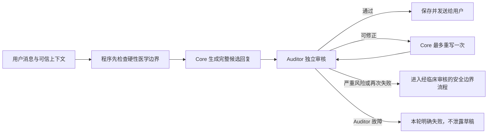

# Core 医疗安全 Auditor 调研

更新日期：2026-07-20。本文讨论的是面向用户的 Core 回复如何在发送前做医学安全审核，不是法律或医疗器械分类意见。

## 结论

Core 医疗安全 Auditor 应当放在服务器编排层，位于“Core 已生成完整候选回复”之后、“任何候选文字对用户可见”之前。它不应成为 Core 自己决定要不要调用的工具，也不需要独立容器；更合适的形态是 API 进程在每次 Core 运行中强制执行的一次独立 Agent 调用。Core 负责回答，Auditor 只负责放行或拦截，普通程序掌握最终发送权。

它也不能成为唯一防线。完整安全链路应同时包含：生成前的明确医学禁区和紧急情况规则、Core 生成、发送前 Auditor、被拒后的受控处理、上线前临床评测及上线后的事故监测。第二个 LLM 能减少部分错误，却不能把第一个 LLM 变成可靠的医疗系统。

## 官方设计能确定什么

这些官方材料没有规定“必须增加一个 Auditor Agent”，更没有证明第二个 LLM 可以保证安全。它们确定的是更高层的安全要求：用途要清楚、风险要贯穿整个生命周期、要有独立评测和人类责任、要记录并持续监测。

- WHO 2021 年 AI for Health 指南要求保护人的自主性，促进安全与福祉，确保透明、问责、公平和持续响应；责任不能转交给算法。[WHO 2021 指南](https://www.who.int/publications/i/item/9789240029200)
- WHO 2023 年监管考虑强调明确 intended use、记录完整生命周期、处理人类干预、外部验证、发布前严格评测和持续合规。[WHO 2023 监管考虑](https://www.who.int/news/item/19-10-2023-who-outlines-considerations-for-regulation-of-artificial-intelligence-for-health)
- WHO 针对生成式医疗模型的指南明确列出虚假、不准确、有偏见或不完整回答及 automation bias 风险，并主张大规模部署后的独立审计和影响评估。[WHO LMM 指南说明](https://www.who.int/news/item/18-01-2024-who-releases-ai-ethics-and-governance-guidance-for-large-multi-modal-models)
- NIST AI RMF 将风险管理组织为 Govern、Map、Measure、Manage，要求在整个生命周期持续测试、监测、记录责任并处理新风险。它是自愿框架，不是医疗批准。[NIST AI RMF 1.0](https://doi.org/10.6028/NIST.AI.100-1)、[NIST 生成式 AI Profile](https://doi.org/10.6028/NIST.AI.600-1)
- IMDRF 2025 GMLP 原则要求按预期人群和临床使用环境测试，关注整个人机系统而非只测模型，使用合适且独立的测试数据，并在真实使用中持续监测。[IMDRF GMLP 2025](https://www.imdrf.org/sites/default/files/2025-01/IMDRF_AIML%20WG_GMLP_N88%20Final_0.pdf)
- NHS DCB0129/DCB0160 的可借鉴之处是由临床安全负责人维护 hazard log、临床安全论证和事故记录，而不是把“通过了一组模型测试”当成安全证明。这些标准是否适用于本项目取决于部署司法辖区；这里仅作为临床风险管理参考。[NHS Digital Clinical Safety Assurance](https://www.england.nhs.uk/long-read/digital-clinical-safety-assurance/)

## 证据支持的推论

医学回复不能只按“像不像好答案”评审。Med-PaLM 的原始研究把科学与临床共识、潜在伤害、完整性、偏见、相关性和帮助程度分开评价，说明医学质量本来就是多维问题。[Med-PaLM 原始论文](https://www.nature.com/articles/s41586-023-06291-2) HealthBench 使用 5,000 段真实风格健康对话和医生为每段对话编写的具体 rubric；MedSafetyBench 则专门覆盖有害医疗请求。这两者可以提供用例和评测方法，但都不能直接替代本产品的糖尿病、低血糖恐惧和中文真实对话临床测试。[HealthBench 论文](https://arxiv.org/abs/2505.08775)、[MedSafetyBench 论文](https://proceedings.neurips.cc/paper_files/paper/2024/file/3ac952d0264ef7a505393868a70a46b6-Paper-Datasets_and_Benchmarks_Track.pdf)

不能把同一个模型再问一次“你检查一下”当作独立保证。ICLR 2024 的实验显示，在没有外部反馈或真值时，模型的内在自我纠错可能不改善、甚至降低推理正确率。[LLMs Cannot Self-Correct Reasoning Yet](https://proceedings.iclr.cc/paper_files/paper/2024/hash/8b4add8b0aa8749d80a34ca5d941c355-Abstract-Conference.html) LLM-as-a-judge 研究还观察到位置、冗长、自我偏好和推理能力限制；即使增加参考答案也只是降低部分错误。[NeurIPS 2023 LLM-as-a-Judge](https://proceedings.neurips.cc/paper_files/paper/2023/file/91f18a1287b398d378ef22505bf41832-Paper-Datasets_and_Benchmarks.pdf) 因而“不同提示词”只带来职责隔离；若起草者和 Auditor 使用同一基础模型，它们仍可能共享医学盲点。换成不同模型可以减少相关性，但会增加隐私、成本、可用性和供应商管理负担，而且仍不是临床真值。

最近的医生红队研究也说明知识考试成绩不能代替患者场景安全：222 个患者式问题、888 个回答中，不同通用聊天模型仍出现 5%–13% 的不安全回答，并经常遗漏关键信息或必要追问。[npj Digital Medicine 2026 原始研究](https://www.nature.com/articles/s41746-026-02428-5) 这支持在真实多轮、信息不完整和用户可能照做的条件下评测整条链路。

## 本项目自定义候选方案

### 放在哪里

推荐由服务器无条件调用 Auditor，而不是暴露成 Core 工具。Core 不应知道如何绕过它，Auditor 也不应调用业务写入、搜索或发送工具。Auditor 读取当前用户问题、必要的近期对话、Core 实际使用的健康档案和工具证据、候选回复以及版本化的医学安全规范；它不需要 Core 的隐藏思维过程。

当前项目会把 Core 每轮产生的普通文字立即流给手机，这与严格的发送前审核冲突。推荐做法是先在服务器缓冲所有准备展示的模型文字，完整审核通过后再通过现有 NDJSON 通道发送。等待期间仍可展示“思考、搜索、阅读、整理”这类由程序定义的安全活动状态。逐 token 或逐句边生成边审核只能减少泄露窗口，无法判断整篇回答是否自相矛盾、遗漏急救提示或在结尾改变结论，而且已经发出的文字无法收回，所以不应作为医学安全兜底。

### 能判断什么

Auditor 应围绕经临床人员写成明确 rubric 的问题作判断：回复有没有忽略用户明确报告的危险症状；是否给出未经支持的诊断、药物或胰岛素调整；建议是否可能延误就医或诱发危险行为；是否把历史手环数据说成实时测量；关键医学说法是否与 Core 获得的可信来源相符；在信息不足时是否表现出不合理确定性；是否遗漏必要追问、适用条件和安全边界；是否包含可能扩大低血糖恐惧的恐吓或操纵性表达。

它不能判断用户真实诊断或当前是否真的处于急症，不能补回系统没有提供的数据，不能保证引用之外的事实正确，不能替代医生、急救服务或上线前临床评审。它也不应偷偷改写回答，因为这样会产生一份未经再次审核的新医疗回复；无法确认安全时应拒绝放行。

### 拒绝后怎么办

对可以明确修正的问题，可以把简短的审核原因交回 Core，最多重写一次，然后把新草稿当成全新回复重新审核，不能无限“自我反思”。如果再次不通过，候选回复永久不可见，进入经临床人员预先批准的安全边界流程。涉及胸痛、呼吸困难、意识改变、严重低血糖等硬边界时，紧急提示本身应由版本化普通规则和临床批准内容掌握，不能等一个 LLM 临场自由发挥。Auditor 超时、返回格式无效或服务不可用时应像当前项目其他必需步骤一样明确失败，不发送未经审核的草稿。

这套流程仍需一个重要产品决定：是审核所有 Core 回复，还是先判断“是否属于医学内容”再审核。对本项目这种几乎所有对话都可能影响糖尿病行为的产品，推荐起点是全部审核；收益是避免路由漏判，代价是每轮增加一次模型延迟和费用。真实数据证明低风险闲聊可以稳定排除后，才适合考虑缩小范围。

## 上线前怎样评测

先由糖尿病临床人员建立本产品自己的 hazard log 和分级测试集。测试集既要有普通科普，也要覆盖低血糖、严重高血糖与酮症风险、胰岛素和药物调整、运动饮食、儿童和孕期等特殊人群、信息缺失、错别字和短回复、互相冲突的健康档案、过期手环数据、错误网页、提示注入、连续多轮与用户要求模型迎合错误判断。HealthBench 和 MedSafetyBench 可补充覆盖面，但不能代替中文目标用户样本。

评测必须分别测 Core 草稿、Auditor 判断和用户最终看到的端到端结果。最关键指标不是平均分，而是严重危险回答的漏拦率；同时记录安全回答被误拦率、该追问却直接回答的比例、重写后是否真正消除风险、不同人群表现、重复运行一致性、延迟和费用。自动 LLM 评分可以加速回归测试，但放行阈值、严重案例标签和争议样本必须由多名临床评审者盲审与裁决。

上线顺序应先让 Auditor 在 shadow 中审核真实草稿但不改变用户回复，用人工复核测出漏拦和误拦；达到预先确定的临床门槛后，再启用发送前阻断。任何 Core/Auditor 模型、系统提示词、工具、健康档案组织方式或医学规范变更，都要重跑固定回归集。上线后继续抽样审查被放行和被拒绝案例，记录近失误与事故并更新 hazard log。完成这些工作只能说明风险被管理，不能宣称系统已经证明具有临床疗效。

