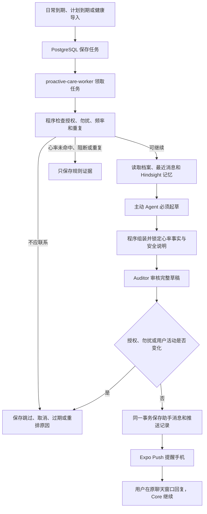

# 主动关怀接入方案

## 当前状态

主动关怀的完整代码链路已经接通：PostgreSQL 持久任务、独立 Worker、主动关怀 Agent、独立 Auditor、Hindsight 召回、唯一聊天消息提交、Expo Push、手机设置、计划回访工具，以及 Android Health Connect 后台周期同步。日常问候、用户明确同意的计划回访和通过规则的心率关怀，都使用同一条 Agent→Auditor→聊天消息→手机推送链路。

心率仍先由确定性规则判断。数值未命中、运动或睡眠挡住、上下文不完整、数据过旧或与已有事件重复时，只保存可复核结果，不进入 Agent 也不发消息。首个有效候选会进入 Agent、Auditor 和推送链路。产品不提供演示按钮、模拟开关或用户可见测试入口；开发测试使用的构造数据只存在测试环境。

Firebase Android App、项目自己的 `google-services.json` 和 EAS FCM v1 凭据已经配置，新的 development 与 preview APK 均已成功生成。服务账号私钥只保存在用户的项目外目录和 EAS，不进入仓库或 APK。2026-08-10，Android 真机已完成 Expo Token 登记，并在 App 退到后台后收到一条经 Expo 和 FCM 投递的系统通知。该次只验证推送通道，没有伪造主动关怀消息；完整的 Agent 起草、Auditor 审核、聊天落库、系统通知和点击回到对应消息仍需通过一次真实关怀任务验收。Android 后台 Health Connect 也仍需验证系统调度与厂商省电行为。

## 设计思路

主动关怀 Agent 是独立 Agent，但不是 Core Agent 在用户聊天中调用的工具。后台任务到期后，Worker 直接启动它；它写下正常的助手消息，用户回复时仍由现有 Core Agent 接着聊。这样不会伪造一条用户消息，也不会把后台运行塞进当前聊天请求。

程序、主动 Agent 和 Auditor 的职责边界是：

- 普通程序决定是否有资格联系，包括授权、免打扰、联系频率、数据新鲜度、异常规则、事件合并、任务恢复、消息提交和推送。
- 主动 Agent 只根据已经筛好的触发事实、档案、近期对话和陪伴记忆决定怎样自然开口。日常和计划任务生成完整短消息；心率任务只生成一句询问主观感受的问题，测量时段、统计值和安全说明由程序拼成最终消息。三类任务通过程序门槛后都必须起草，不能再随意 `skip`。
- Auditor 只批准或拒绝草稿，不能改写草稿、改变风险结论或执行发送。

主动 Agent 没有业务工具，不能修改健康档案、计划、风险级别、发送时间或推送设置。健康事实和将来的固定安全提示必须由程序生成并锁定，不能交给模型自由改写。

## 三种触发

| 触发 | 怎样产生 | 当前行为 |
| --- | --- | --- |
| 日常问候 | 用户在设置中选择每天、每三天或每周；从最后一次用户发言重新计时 | 避开免打扰、用户刚继续聊天和近 24 小时内已成功发送的主动消息；通过后必须起草，默认关闭 |
| 计划回访 | 用户在对话中明确同意一个计划和回访时间，Core 调用 `manage_care_plan` | 到期并通过授权、免打扰和用户活动检查后必须起草；不受日常问候的 24 小时保护阻挡 |
| 心率关怀 | Health Connect 导入真实新增、更新或删除后登记检查任务 | 未命中、被规则阻断或属于重复事件时不发；首个有效候选通过设置和免打扰检查后必须起草 |

计划工具只接受 `create/update/complete/cancel`。程序要求操作引用当前用户消息中的原话，并校验计划归属、未来时间、时区、一次消息一次操作和重试幂等性；表达不完整时 Core 必须先追问。

## 运行链路

Worker 复用后端镜像，内部是一个 asyncio 循环。任务和恢复状态都在 PostgreSQL，不引入 Celery、Redis、Kafka、通用事件总线或每用户常驻协程。Health Connect 导入完成时直接登记本次变化，不反复扫描每个用户的整张健康数据表。

## 数据库里保存什么

| 记录 | 实际含义 |
| --- | --- |
| `proactive_care_settings` | 一位用户的日常频率、计划/健康开关、时区、免打扰和健康通知正文权限 |
| `care_plans` | 用户明确同意以后复盘的一项计划及当前版本 |
| `proactive_care_tasks` | 一次待评估的日常、计划或健康任务，以及租约、结果原因和版本化健康证据 |
| `push_installations` | 一次 App 安装、当前登录会话、Expo Push Token 和通知权限 |
| `push_deliveries` | 一条已保存消息向一台手机发送 ticket、查询 receipt 和有限重试的过程 |

`AgentRun` 的触发来源只能二选一：用户消息或主动关怀任务。任务不重复保存助手正文；正文仍只存在现有 `messages`，推送记录引用这条消息。推送重试不会再次调用 Agent。

## 并发、恢复和失败

Worker 使用 `FOR UPDATE SKIP LOCKED` 和随机租约领取任务，远程调用期间不占数据库事务。租约过期后任务可被重新领取，旧 Worker 不能再覆盖新结果。聊天发送、手环导入和主动消息最终提交共用用户级 PostgreSQL 锁；主动 Agent 起草完成后再次确认用户没有插话，若用户已经发言，旧草稿不会进入聊天。

任务明确区分 `completed/skipped/failed/expired/cancelled`。Hindsight、模型、Auditor 或 Expo 失败会记录失败并进行受限重试，不使用静态话术兜底，也不在失败后假装成功。消息一旦成功提交，后续崩溃只恢复推送，不重新生成第二条消息。

Hindsight 在 `online` 模式下是主动关怀生成前的必需步骤，失败会让该次任务失败；`disabled` 或 `shadow` 模式不进行主动召回。真实消息按数据库顺序写入 Hindsight，因此“主动助手提问 → 用户只回一句‘好多了’ → Core 接话”的语境不会丢失。

## 手机推送和后台同步

主动消息先写入聊天，再建立每台有效安装的推送记录。日常和计划通知直接显示 Agent 写的短消息；健康通知默认只显示“有一条新的健康关怀消息”，只有用户明确开启预览才显示正文。payload 只放消息、发送记录和固定类型 ID，不放健康数值、计划结构或正文。Expo ticket/receipt 只证明推送服务接受了请求，不能证明手机已经展示或用户已经看到。

这里有两个平台本身无法消除的边界。第一，Expo 已收到发送请求、但服务端没有收到响应时，重试可能让系统通知出现两次；相同折叠 ID 能减少重复，不能承诺绝不重复。第二，普通关怀要由系统直接显示 AI 正文，就必须先把正文交给 Expo/FCM；通知已经排队后，即使用户随即退出或切换账号也无法撤回。彻底避免第二种情况只能把所有锁屏通知改成通用文案，或改用由 App 验证账号后才显示的数据通知，但后者的后台到达可靠性更低。这是可见正文与账号切换隐私之间的产品取舍，不用数据库锁或安装版本号假装能够解决。

App 使用同一个 `ApiClient` 处理前台、通知和后台同步，避免 Refresh Token 轮换竞态。一次后台手环同步从账号核对到每批上传都绑定在启动时的登录状态，退出或换账号会立即终止旧同步。通知安装 ID 的首次创建只执行一次，自动同步、用户授权和原生 Push Token 变化按顺序注册，较早的权限状态不会覆盖较新的选择。手机获取 Expo Push Token 最多等待 15 秒；自动检查与紧接着的手动检查复用同一次请求，失败时明确区分“系统权限已开启”和“推送尚未连接”，不会无限显示正在检查，也不会把晚到的 Token 写入服务器。通知按 `message_id` 合并进现有聊天；点击旧通知会读取目标消息附近的窗口并定位。前台正在流式回复时只登记待刷新，流结束后再合并，不会清掉本地已收到的文字。

Health Connect 后台任务最短请求间隔为 15 分钟，但 Android、Doze、厂商省电和 Force stop 都可能继续延后。项目因此只称“后台周期检查”，不称实时监测。前台和后台通过同一个 Promise 互斥推进 Changes Token；Token 失效后会停止继续同步，并在设置里明确说明当前版本不能安全恢复完整历史。用户可以关闭后台检查；后续需要先实现完整历史重建，不能通过清空 Token 或只重读最近数据假装恢复成功。

这些限制来自 [Health Connect 同步](https://developer.android.com/health-and-fitness/health-connect/sync-data)、[Health Connect 后台读取](https://developer.android.com/health-and-fitness/health-connect/read-data)、[Expo BackgroundTask](https://docs.expo.dev/versions/v57.0.0/sdk/background-task/) 和 [Expo Push 配置](https://docs.expo.dev/push-notifications/push-notifications-setup/)。Expo Go 不能验收 SDK 57 的 Android 远程推送，必须使用 development build 或正式构建。当前原生配置使用 `care-checkins-v1` 默认频道、96×96 白色透明图标和 `#20B894` 图标色；App 在前台时由聊天界面合并消息，不再显示一条重复系统横幅。

## 当前自定义参数

下列数字是项目的评测起点，不是医学指南：日常问候默认关闭，界面推荐每三天；日常问候在近 24 小时已成功发送任何主动消息时延后，计划回访不受这个限制；默认免打扰为当地 22:00–08:00；Worker 每 5 秒检查一次、租约 20 分钟、任务最多执行 3 次；Android 后台任务请求最短 15 分钟执行一次。Agent 最多读取最近 10 条消息，整体输入上限 20000 tokens。

心率规则的医学依据、自定义阈值、误报边界和历史回放见 [主动关怀心率规则与安全边界](./proactive-care-heart-rate-rules.md)。当前实现只覆盖成年用户、Zepp 自动采集分钟级心率，并主动排除运动、睡眠、步数活动、上下文不完整、未来时间和过期数据；后到或删除的心率、运动、睡眠和步数会重新计算尚未发送的结果，条件恢复后复用原任务重新排队，已经发出的关怀及其证据保持不变。现有规则版本号仍为 `heart-rate-shadow-v0`，这是为了让旧回放结果可对比，不再表示候选一定停在只读评测。

## 还需要真实验收的内容

代码已连上健康消息，不等于阈值已完成临床验证。首轮回放覆盖当前数据库 31,114 条记录中的 31,230 个心率样本：按每条记录最后导入时间计算，只有 1/33 个批次满足 60 分钟新鲜度；在明确假设“成年人、活动上下文完整、准时到达”后，388 个偏快窗口全部被运动或步数活动挡住，没有窗口进入候选。这些窗口落在 3 段相邻心率时段内，报告按拦截原因保存为 4 组证据。这只能说明当前数据快照中的规则分布，不能还原已更新或删除的旧版本，也不能证明医学准确性或安全性。

下一步先人工复核这 4 组证据和 Zepp 的运动、步数语义；手环恢复后补做真实新鲜数据从 Health Connect、规则、Agent、Auditor、聊天落库到手机推送的完整验收。Firebase/EAS 配置、真机 Token 登记和后台系统通知已经通过；日常、计划和心率的真实 Agent 消息，以及前台合并、通知点击、冷启动、健康隐私、多设备和换账号仍需真机验收。当前家庭网络可以访问 Expo，但直连 Google/Firebase 服务会超时，真机登记和投递需要保持可用的 Google 服务网络。临床人员仍需在真实用户发布前复核阈值、误报、症状询问和急救边界；这不影响当前产品完成工程链路。
